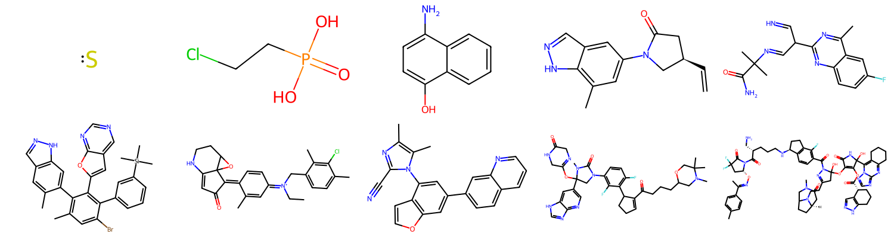

# hypothesis-rdkit

A strategy to generate random molecules for the hypothesis testing framework.




## Installation

```sh
pip install -U hypothesis-rdkit
```

## Usage

The module ```hypothesis-rdkit``` provides a strategy for generating RDKit 
molecules. During the installation of the package, this strategy is linked to the 
```rdkit.Chem.Mol``` type:


```python
from hypothesis import given
from rdkit.Chem import Mol

@given(...)
def test_molecule_method(mol : Mol):
    # mol is a randomly generated molecule
    assert mol.GetNumAtoms() > 0
```

You can use the ```mols``` strategy directly for further customization:

```python
from hypothesis import given  # import hypothesis before hypothesis_rdkit!
from hypothesis_rdkit import mols
from rdkit.Chem import GetMolFrags, Mol
from rdkit.Chem.rdMolDescriptors import CalcNumRotatableBonds

@given(mols(n_connected_components=2, max_num_rotatable_bonds=5))
def test_molecule_mixtures(mol : Mol):
    frags = GetMolFrags(mol, asMols=True)
    assert len(frags) == 2

    for frag in frags:
        assert CalcNumRotatableBonds(frag) <= 5
```